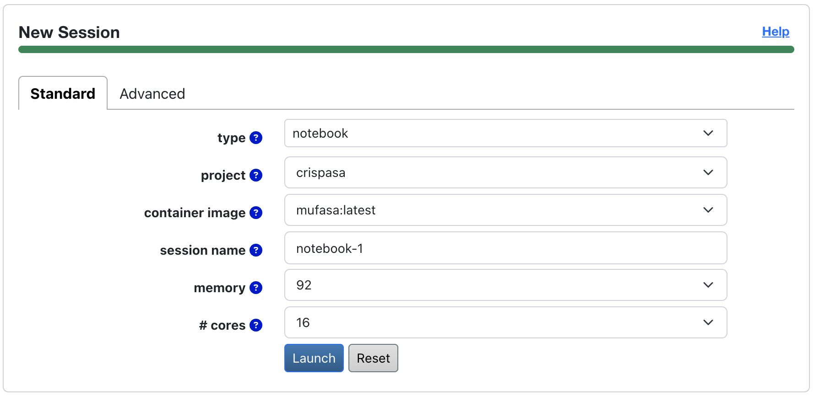

Guides
======

Welcome to **MUFASA**'s guides. To get started or to learn from tutorials, please see
:doc:`Quick Start <quick_start>` and :doc:`Tutorials <tutorials/index>`.

Preinstalled Cloud Access:
--------------------------
For the astrophysics community, MUFASA is available preinstalled on the `CANFAR Science Portal <https://www.canfar.net>`_
via `docker containers <https://www.docker.com/resources/what-container/>`_. Interactive container sessions are
accessible by browser-based Jupyter Lab interface, which also supports a Unix terminal and direct upload/download interfaces.
To request an account and get started with the Science Portal, please see CANFAR's
`documentation <https://www.opencadc.org/science-containers/complete/>`_ page.

To launch a MUFASA notebook container session:

1. Sign onto the `Science Portal <https://www.canfar.net/science-portal/>`_
2. Navigate to the ''New Session'' panel (see image below for an example)
3. Select ''notebook'' for a session
4. Select ''crispasa'' under ''project''
5. Select a version of preinstalled MUFASA before launching a session

\

.. note::

    When requesting memory with the Science Portal, pick a value that's about 20 times the size of your image cube.

Data Products
--------------

Fitted models
^^^^^^^^^^^^^

MUFASA's data products include fitted parameter maps and images derived from the best-fit model images, such as
the model moment map. For more details, please see the :ref:`outputs-section` Section.

Metadata
^^^^^^^^^
The MUFASA version that produced a data product, as well as the time the product was written, are recorded
in the product's FITS header under 'HISTORY'.

Contributing
-------------

Contributing to MUFASA is most welcome! The main areas for improvement are:

- Adding new molecular spectral models (e.g., CO, HCN)
- Implementing a three-component fit pipeline
- Perform quantitative tests on MUFASA's performance with different spectral models

The first step to contributing is by joining a GitHub `discussion <https://github.com/mcyc/mufasa/issues>`_
on your topic of interest or starting a new `issue <https://github.com/mcyc/mufasa/issues>`_. Conversations
on how to contribute will proceed from there.

Custom Usage & Pipeline
--------------------------
For guides on advanced custom usage for MUFASA please see
:doc:`Custom Usage <tutorials/custom_usage>`.

Reference Materials
----------------------
For detailed information on all available modules, classes, and methods, please refer to
:doc:`API Reference <api/index>`.